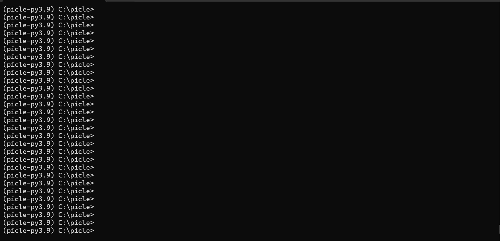

# Introducing PICLE

Command-line interface (CLI) is the software interface used to
interact with the system. From CLI you can run commands and receive
output.

The command-line interface usually includes lots of shortcuts and 
commands to get help, auto completion, argument choices and validation 
of input.

PICLE creates structures of shell modes hierarchies, as illustrated in 
Figure 1. The hierarchy of each mode is made up of cascading branches 
of related commands and their functions.

```
Root
   |-command -> Model
     |-command -> Field
	 |-command -> Field
     |-command -> Field
     |-RUN Function					
   |-command -> Function
   |-command -> Model
     |-Shell
       |-command -> Field
       |-command -> Model
	     |-command -> Field
	     |-RUN Function	
```			  

Figure 1. Sample shells hierarchy.

Each shell has its own prompt and a set of commands.

Commands parsed sequentially in the order they are inputted on the 
command line.

Each command can point to one of:

- Pydantic model with or without shell 
- A Pydantic model field with values to collect
- A function to run

Each model may have a ``RUN`` function defined, this function
executed with collected field values.

## Sample Application

PICLE uses Pydantic models to construct interactive shells and their commands. 
For example, to create interactive shell that has this structure:

```
Root
   |-show -> model_show
     |-version -> Function - output software version
   	 |-clock -> Function - display system time
```

Can use code below:

```
import time
from picle import App
from typing import Callable
from pydantic import BaseModel, Field


class model_show(BaseModel):
    version: Callable = Field("show_version", description="Show software version")
    clock: Callable = Field("show_clock", description="Show current clock")
    
    @staticmethod
    def show_version():
        return "0.1.0"
    
    @staticmethod
    def show_clock():
        return time.ctime()
    
    
class Root(BaseModel):
    show: model_show = Field(None, description="Show commands")
    
    class PicleConfig:
        prompt = "picle#"
        intro = "PICLE Sample app"
        

if __name__ == "__main__":
    shell = App(Root)
    shell.start()
```

Each Pydantic model can have ``PicleConfig`` subclass defined
listing model configuration.

``Root -> show`` model field refers to ``model_show`` Pydantic model
which has two fields ``version`` and ``clock`` each referring to 
callable function which is executed when user hits ENTER on the
command line.

Run above code with ``python myshellfile.py`` command and interact with 
the shell:



